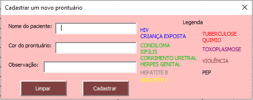
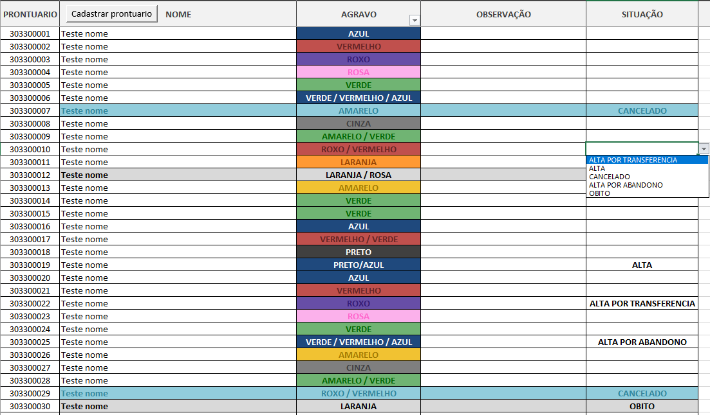

<p align="center">
  
  <a href="https://twitter.com/piterparquinho">
    
  </a>
  
   
  <a href="https://rocketseat.com.br">
    
  </a>

# Spreadsheet for medical records registration in Excel Macro
<h4 align="center"> 
	✅ Completed Spreadsheet ✅
</h4>

<p align="center">
 <a href="#about">About</a> •
 <a href="#how-to-use">How to Use</a> •  
 <a href="#author">Author</a> • 
  <a href="#license">License</a> • 
 <a href="#readme">Versions of README</a>
</p>

## About
This spreadsheet was created when I was an intern at an infectious disease center and faced a problem from the beginning, which was the registration of medical records in the Excel spreadsheet.

The problem with the registration is that it was done by many people with different levels of knowledge in computers and Excel, so many times the spreadsheet suffered some typing problems or color order. Because of this I created a small form to assist in the registration, where it is possible to visualize the colors of the respective disease and the order of its priority. 

I also configured the automatic filling of its respective color according to its priority, through the formatting of the conditional.

<p align="center">

</p>

With this, the chance of filling in the wrong color becomes smaller than how it was done before, and it also becomes even faster.

 ## How to Use
 Through a button seen at the top of the spreadsheet, it is possible to open this form and it is here that it was possible to register the medical records at the reception that were passed on to us by the people responsible for registering the new cases. 
 
 After filling in the form, the register appeared ready and formatted correctly on the spreadsheet, with the colors already correctly filled in.

<p align="center">
   
</p>

It is also possible to change the status of the records. Those records that we would no longer move for some reason and would be taken to another room where they would be filed, these records are highlighted on the spreadsheet.

<p align="center">

</p>

 ### Macros
 Macros used in the form. Text written with a ' at the beginning of the line, are some comments I made to localize myself.
```
'Identifica o tipo do objeto e insere se for um dos tipos definidos
Private Sub lsInserir(ByRef lTextBox As Variant, ByVal Plan1 As String, ByVal lColunaCodigo As Long, ByVal lUltimaLinha As Long)
    If (TypeOf lTextBox Is MSForms.TextBox) Or (TypeOf lTextBox Is MSForms.ComboBox) Then
        Sheets(Plan1).Range(lTextBox.Tag & lUltimaLinha).Value = lTextBox.Text
    Else
        If TypeOf lTextBox Is MSForms.OptionButton Then
            If lTextBox.Value = True Then
                Sheets(Plan1).Range(lTextBox.Tag & lUltimaLinha).Value = lTextBox.Caption
            End If
        End If
    End If
End Sub

'Loop por todos os componentes da tela
'frmProntuario = Nome do UserForm atual
'Plan1 = Nome da planilha aonde irão ser inseridos os valores
'lColunaCodigo = Coluna de referência para a inserção dos dados
Public Function lsInserirTextBox(frmProntuario As UserForm, ByVal Plan1 As String, ByVal lColunaCodigo As Long)
    Dim controle            As Control
    Dim lUltimaLinhaAtiva   As Long
    
    lUltimaLinhaAtiva = Worksheets(Plan1).Cells(Worksheets(Plan1).Rows.Count, lColunaCodigo).End(xlUp).Row + 1
    
    For Each controle In frmProntuario.Controls
        lsInserir controle, Plan1, lColunaCodigo, lUltimaLinhaAtiva
    Next
End Function

'Limpa todos os objetos TextBox da tela
Public Function lsLimparTextBox(frmProntuario As UserForm)
    Dim controle            As Control
    
    For Each controle In frmProntuario.Controls
        If TypeOf controle Is MSForms.TextBox Then
            controle.Text = ""
        End If
    Next
End Function

'Aciona o botão de limpar
Private Sub CommandButton1_Click()
    lsLimparTextBox frmProntuario
    
    TextBox1.SetFocus
End Sub

'Aciona o botão de inserir
Private Sub CommandButton2_Click()
    lsInserirTextBox frmProntuario, "PRONTUARIO", 2
    
    lsLimparTextBox frmProntuario
    
    TextBox1.SetFocus
End Sub

Private Sub TextBox1_Change()
    TextBox1 = UCase(TextBox1)
    'Ucase = Upper case
End Sub

Private Sub TextBox2_Change()
    TextBox2 = UCase(TextBox2) 'Ucase = Upper case
End Sub

Private Sub TextBox3_Change()
    TextBox3 = UCase(TextBox3)
    'Ucase = Upper case
End Sub
 ```
 ***
Macro used to call the form on the button located at the top of the spreadsheet
<p align="center">
   
</p>

```
Sub ChamarFormProntuario()
    frmProntuario.Show
End Sub
```

## Author
<p align="center">
 
 <br />
 <sub><b>Vitória Garrucho</b></br> Made with ❤️</sub></p>

<p align="center">Contact me through my social!<br>
<a href="https://twitter.com/piterparquinho" target="_blank"></a>
<a href="https://www.linkedin.com/in/vitoriagarrucho/" target="_blank"></a>
<a href="mailto:vitoriagarrucho@gmail.com" target="_blank"></a>
 </p>

## License

This project is under license [MIT](./LICENSE).

Made with ❤️ by Vitória Garrucho

<a href="https://www.linkedin.com/in/vitoriagarrucho/" target="_blank">Contact me!</a>

## README
[Português](./README.md)  |  [English](./README-en.md)
