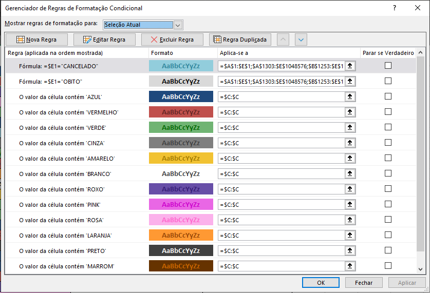
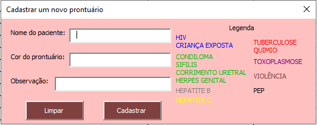
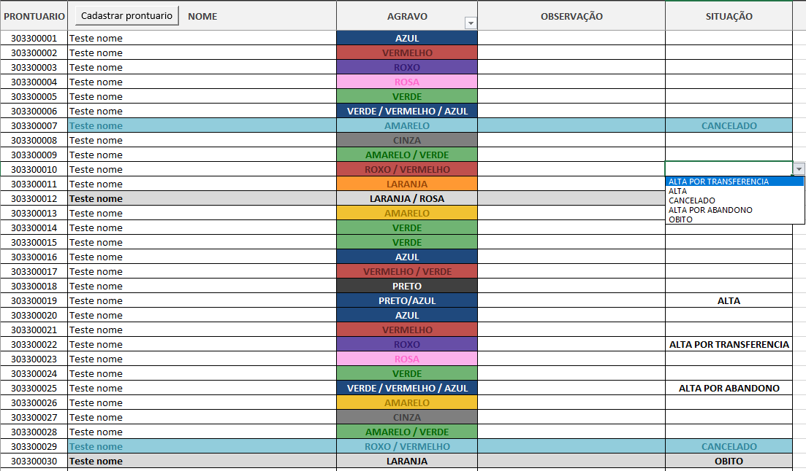
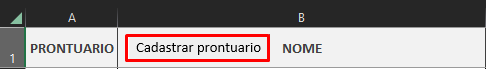

<p align="center">
  
  <a href="https://twitter.com/piterparquinho">
    
  </a>
  
   
  <a href="https://rocketseat.com.br">
    
  </a>

# Planilha de cadastro de prontuários em Excel Macro
<h4 align="center"> 
	✅ Planilha Concluída ✅
</h4>

<p align="center">
 <a href="#objetivo">Objetivo</a> •
 <a href="#como-usar">Como Usar</a> •  
 <a href="#autor">Autor</a> • 
  <a href="#licença">Licença</a> • 
 <a href="#readme">Versões do README</a>
</p>

## Objetivo
Essa planilha foi criada na época em que eu estagiava em um centro de infecctologia e enfrentava um problema desde o começo que era o cadastro de prontuário na planilha do Excel.

O problema do cadastro é que ele era feito por muitas pessoas com diferentes níveis de conhecimento em informática e excel, por isso, muitas das vezes a planilha sofria alguns problemas de digitação ou ordem das cores. Por conta disso criei um pequeno formulário para auxiliar no cadastro, onde é possível visualizar as cores de respectiva doença e a ordem da sua prioridade. 

Também configurei o preenchimento automático de sua respectiva cor de acordo com sua prioridade, através da formatação da condicional.

<p align="center">

</p>

Com isso, a chance do preenchimento da cor errada se torna menor do que como era feita anteriormente e também se torna ainda mais rápido.


 ## Como Usar
 Através de um botão visto no topo da planilha, é possível abrir esse formulário e é aqui que era possível cadastrar os prontuários na recepção que eram repassados para nós pelos responsáveis pelo registro dos novos casos. 
 
 Após o preenchimento, o cadastro já aparecia pronto e formatado da maneira correta na planilha e com as cores já preenchidas também corretamente.

<p align="center">
   
</p>

Também é possível alterar a situação dos prontuário. Aqueles prontuários que não mexeriamos mais por algum motivo e seria levado para uma outra sala onde seria arquivado, estes prontuários ficam com a linha em evidência na planilha.

<p align="center">

</p>

 ### Macros
 Macros utilizadas no formulário. Textos escritos com um ' no começo da linha, são alguns comentários que fiz para me localizar.
 ```
'Identifica o tipo do objeto e insere se for um dos tipos definidos
Private Sub lsInserir(ByRef lTextBox As Variant, ByVal Plan1 As String, ByVal lColunaCodigo As Long, ByVal lUltimaLinha As Long)
    If (TypeOf lTextBox Is MSForms.TextBox) Or (TypeOf lTextBox Is MSForms.ComboBox) Then
        Sheets(Plan1).Range(lTextBox.Tag & lUltimaLinha).Value = lTextBox.Text
    Else
        If TypeOf lTextBox Is MSForms.OptionButton Then
            If lTextBox.Value = True Then
                Sheets(Plan1).Range(lTextBox.Tag & lUltimaLinha).Value = lTextBox.Caption
            End If
        End If
    End If
End Sub

'Loop por todos os componentes da tela
'frmProntuario = Nome do UserForm atual
'Plan1 = Nome da planilha aonde irão ser inseridos os valores
'lColunaCodigo = Coluna de referência para a inserção dos dados
Public Function lsInserirTextBox(frmProntuario As UserForm, ByVal Plan1 As String, ByVal lColunaCodigo As Long)
    Dim controle            As Control
    Dim lUltimaLinhaAtiva   As Long
    
    lUltimaLinhaAtiva = Worksheets(Plan1).Cells(Worksheets(Plan1).Rows.Count, lColunaCodigo).End(xlUp).Row + 1
    
    For Each controle In frmProntuario.Controls
        lsInserir controle, Plan1, lColunaCodigo, lUltimaLinhaAtiva
    Next
End Function

'Limpa todos os objetos TextBox da tela
Public Function lsLimparTextBox(frmProntuario As UserForm)
    Dim controle            As Control
    
    For Each controle In frmProntuario.Controls
        If TypeOf controle Is MSForms.TextBox Then
            controle.Text = ""
        End If
    Next
End Function

'Aciona o botão de limpar
Private Sub CommandButton1_Click()
    lsLimparTextBox frmProntuario
    
    TextBox1.SetFocus
End Sub

'Aciona o botão de inserir
Private Sub CommandButton2_Click()
    lsInserirTextBox frmProntuario, "PRONTUARIO", 2
    
    lsLimparTextBox frmProntuario
    
    TextBox1.SetFocus
End Sub

Private Sub TextBox1_Change()
    TextBox1 = UCase(TextBox1)
    'Ucase = Upper case
End Sub

Private Sub TextBox2_Change()
    TextBox2 = UCase(TextBox2) 'Ucase = Upper case
End Sub

Private Sub TextBox3_Change()
    TextBox3 = UCase(TextBox3)
    'Ucase = Upper case
End Sub
 ```
 ***
Macro utilizada para chamar o formulário no botão localizado no topo da planilha

<p align="center">
   
</p>

```
Sub ChamarFormProntuario()
    frmProntuario.Show
End Sub
```

## Autor
<p align="center">
 
 <br />
 <sub><b>Vitória Garrucho</b></br> Feito com ❤️</sub></p>

<p align="center">Entre em contato através das minhas redes sociais!<br>
<a href="https://twitter.com/piterparquinho" target="_blank"></a>
<a href="https://www.linkedin.com/in/vitoriagarrucho/" target="_blank"></a>
<a href="mailto:vitoriagarrucho@gmail.com" target="_blank"></a>
 </p>

## Licença

Este projeto esta sobe a licença [MIT](./LICENSE).

Feito com ❤️ por Vitória Garrucho

<a href="https://www.linkedin.com/in/vitoriagarrucho/" target="_blank">Entre em contato!</a>

## README
[Português](./README.md)  |  [English](./README-en.md)